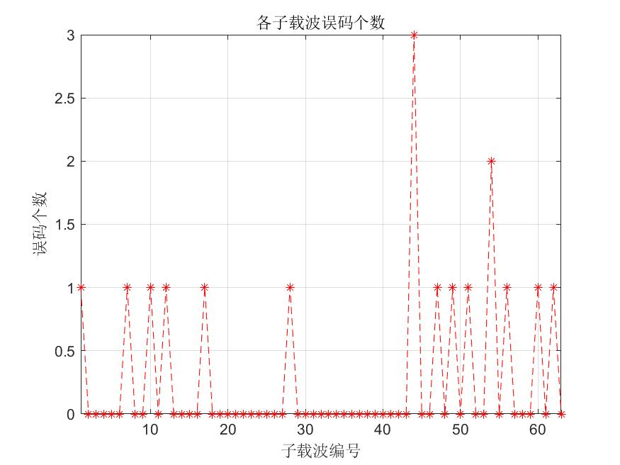

# 基于16QAM调制的OFDM最简系统仿真实现

## 实验框图：

## 实验流程：

根据 OFDM 基本原理,利用 MATLAB 平台，在发送端产生随机二进制信号以后，依次通过**星座映射**、**串并变换**、**IFFT**、经过**高斯加性白噪声信道**、**FFT**，经在接收端接收后经过**FFT**、**并串变换**、解调恢复出原始二进制数据，并**与发送端比较求误码率**。

## 实验参数：

* 二进制信源采用随机数生成，长度为$子载波数量\times 符号比特数 \times 子载波信道符号数$，其中子载波数量取**IEEE802.11ax**规定的256个，子载波信道符号数取500个，符号比特在16QAM调制下为$log_2{16}=4$。
* 加性高斯白噪声信道(AWGN)中采用信噪比SNR为15的情况

## 实验过程：

先进行SNR=15、信道符号数为500的情况下的结果研究，实验结果如下所示：

## 实验分析

#### 1.改变高斯白噪声信道的信噪比

如图所示，分别为信噪比SNR=10：

与信噪比=20时：

与SNR=15的情况对比可见，信噪比越大，误码的情况越少。

#### 2.改变子载波数量

改变子载波数量为128，信噪比保持15不变，可得到如下实验结果：

可见子载波数量越少，无码情况越多。

#### 3.改变子载波符号数量

改变符号数量为100，得到如下结果：

虽然误码数减小了，但误码占总符号的比例还是与原来近似（SNR=15时，误码率为0.064，此处为0.07）。

## 实验结论

在加性高斯白噪声信道中，信噪比与子载波数量决定了误码率大小。子载波数量越大，信噪比越大，误码率越低。