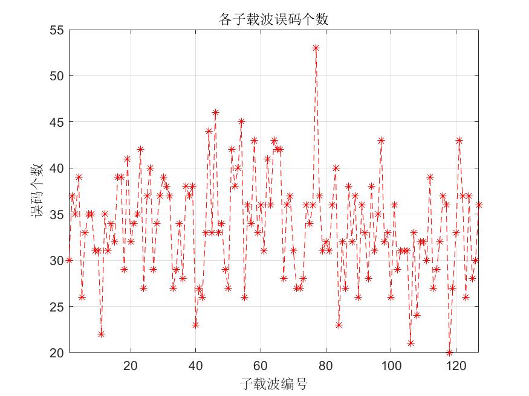
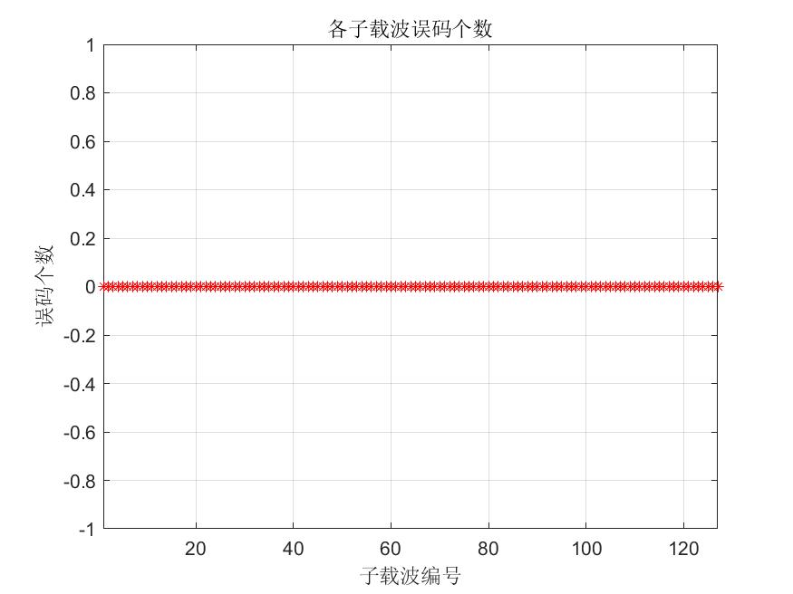
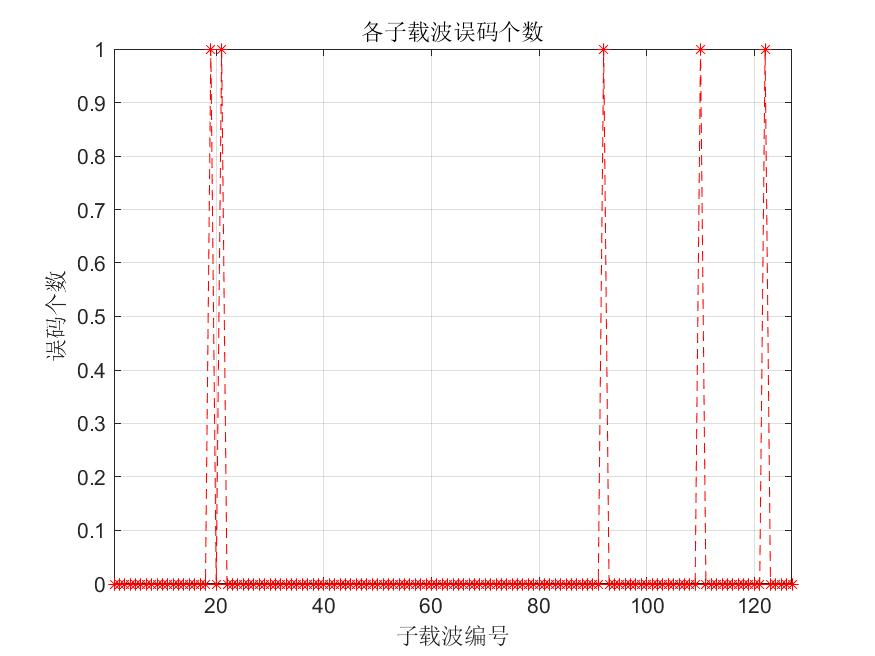

# 探究时延与相干带宽关系

## 一、实验内容

给定一维矩阵$H(x)=$[1 0.5 0 0 0 0 0 0 0 0 0 0 0 0 0 0],其每一个元素代表一个信道的幅频响应。在改变矩阵元素幅值大小、各元素位置、相位差以及矩阵列数可近似拟合多信道模型简化为幅度改变、位置改变、相位改变以及增加/减少路径的情况。在进行完对应处理后，对矩阵进行1024点FFT计算，并作出图像，探究相干带宽与时延的关系。

## 二、实验过程

### 1.改变位置的情况

给定原序列`origin=[1 0.5 0 0 0 0 0 0 0 0 0 0 0 0 0 0]`,先对元素位置进行重排，进行位置改变的拟合：

`location1=[1 0 0 0 0 0 0 0 0 0 0 0 0 0 0.5 0];
location2=[1 0 0 0 0 0 0.5 0 0 0 0 0 0 0 0 0];`


从图像可以看出当时延扩展$T_W$增大时，对应的相干带宽$B_c$减少，近似成反比关系。

### 2.改变幅度的情况

给定原序列`origin=[1 0.5 0 0 0 0 0 0 0 0 0 0 0 0 0 0]`,先对元素幅度值进行修改，然后进行FFT变换后画图做出如下图象：

`amplitude1=[1 1.3 0 0 0 0 0 0 0 0 0 0 0 0 0 0];
amplitude2=[1 0.2 0 0 0 0 0 0 0 0 0 0 0 0 0 0];`


从结果图像中可以看出，当改变幅度大小时，频域幅度变化成正相关关系。

### 3.改变相位的情况

给定原序列`origin=[1 0.5 0 0 0 0 0 0 0 0 0 0 0 0 0 0]`,先对元素相位值进行修改，然后进行FFT变换后画图做出如下图象：

`phase1=[1 0.5*exp(1i*pi/3) 0 0 0 0 0 0 0 0 0 0 0 0 0 0];
phase2=[1 0.5*exp(1i*pi/8) 0 0 0 0 0 0 0 0 0 0 0 0 0 0]`


从图中可以看出，当相位发生改变时，频域图像只是产生了平移，没有改变波形。

### 4.改变信道个数的情况

给定原序列`origin=[1 0.5 0 0 0 0 0 0 0 0 0 0 0 0 0 0]`,对矩阵进行列拓展，然后进行FFT变换后画图做出如下图象：

`num1=[1 0.5 0 0.8 0 0 0 0 0 0 0 0 0 0 0 0];
num2=[1 0.5 0 0.8 0 0.3 0 0 0 0 0 0 0 0 0 0];`


从结果图像中可以看出，当信道数增加后，频域图象发生改变。信道数会影响多径传输的效果。


## 代码附录

```matlab
%------------------原矩阵--------------------
origin=[1 0.5 0 0 0 0 0 0 0 0 0 0 0 0 0 0];
%------------------改变位置------------------
location1=[1 0 0 0 0 0 0 0 0 0 0 0 0 0 0.5 0];
location2=[1 0 0 0 0 0 0.5 0 0 0 0 0 0 0 0 0];
%------------------改变幅度------------------
amplitude1=[1 1.3 0 0 0 0 0 0 0 0 0 0 0 0 0 0];
amplitude2=[1 0.2 0 0 0 0 0 0 0 0 0 0 0 0 0 0];
%------------------改变相位------------------
phase1=[1 0.5*exp(1i*pi/3) 0 0 0 0 0 0 0 0 0 0 0 0 0 0];
phase2=[1 0.5*exp(1i*pi/8) 0 0 0 0 0 0 0 0 0 0 0 0 0 0];
%------------------改变个数------------------
num1=[1 0.5 0 0.8 0 0 0 0 0 0 0 0 0 0 0 0];
num2=[1 0.5 0 0.8 0 0.3 0 0 0 0 0 0 0 0 0 0];
%------------------1024点FFT-----------------
Origin=abs(fft(origin,1024));

Location1=abs(fft(location1,1024));
Location2=abs(fft(location2,1024));

Amp1=abs(fft(amplitude1,1024));
Amp2=abs(fft(amplitude2,1024));

Phase1=abs(fft(phase1,1024));
Phase2=abs(fft(phase2,1024));

Num1=abs(fft(num1,1024));
Num2=abs(fft(num2,1024));


figure(1);
plot(Origin,'r');
hold on;
plot(Location1,'g');
hold on;
plot(Location2,'b');
legend('Origin','location1','location2');
title('改变位置');
xlabel('频率');
ylabel('幅度');
saveas(gcf,'改变位置.jpg')

figure(2);
plot(Origin,'r');
hold on;
plot(Amp1,'g');
hold on;
plot(Amp2,'b');
legend('origin','Amp1','Amp2');
title('改变幅度');
xlabel('频率');
ylabel('幅度');
saveas(gcf,'改变幅度.jpg')
figure(3);
plot(Origin,'r');
hold on;
plot(Phase1,'g');
hold on;
plot(Phase2,'b');
legend('origin','phase1','phase2');
title('改变相位');
xlabel('频率');
ylabel('幅度');
saveas(gcf,'改变相位.jpg')
figure(4);
plot(Origin,'r');
hold on;
plot(Num1,'g');
hold on;
plot(Num2,'b');
legend('origin','num1','num2');
title('改变个数');
xlabel('频率');
ylabel('幅度');
saveas(gcf,'改变个数.jpg')
```


# 基于16QAM调制的OFDM最简系统仿真实现

## 实验框图：


## 实验流程：

根据 OFDM 基本原理,利用 MATLAB 平台，在发送端产生随机二进制信号以后，依次通过**星座映射**、**串并变换**、**IFFT**、经过**高斯加性白噪声信道**、**FFT**，经在接收端接收后经过**FFT**、**并串变换**、解调恢复出原始二进制数据，并**与发送端比较求误码率**。

## 实验参数：

* 二进制信源采用随机数生成，长度为$子载波数量\times 符号比特数 \times 子载波信道符号数$，其中子载波数量取**IEEE802.11ax**规定的256个，子载波信道符号数取500个，符号比特在16QAM调制下为$log_2{16}=4$。
* 加性高斯白噪声信道(AWGN)中采用信噪比SNR为15的情况

## 实验过程：

先进行SNR=15、信道符号数为500的情况下的结果研究，实验结果如下所示：


## 实验分析

#### 1.改变高斯白噪声信道的信噪比

如图所示，分别为信噪比SNR=10：



与信噪比SNR=20时：



与SNR=15的情况对比可见，信噪比越大，误码的情况越少。

如图所示，研究信噪比大小与误码率关系：


#### 2.改变子载波符号数量

改变符号数量为100，得到如下结果：



虽然误码数减小了，但误码占总符号的比例还是与原来近似（SNR=15时，误码率为0.064，此处为0.07）。

## 实验结论

在加性高斯白噪声信道中，信噪比决定了误码率大小。信噪比越大，误码率越低。

## 代码

```matlab
clc
clear all;
close all;
Nt_carr=256;      %子载波数=FFT点数---256
Np_carr=Nt_carr/2-1; %实际子载波数---127
Sig_per_carr=100; %每子载波含符号数---100
bits_per_symbol=4;      %每符号含比特数,16QAM调制为log_2^16=4
y_data=[];
for SNR=5:20
%信噪比,经实验验证信噪比越大的情况下单个子波误码越少，20的时候已经没有误码
%==============================================================
%======================信号产生===================================

raw_input_length=Np_carr * Sig_per_carr * bits_per_symbol;  %所输入的比特数目  127*500*4
raw_input=round(rand(1,raw_input_length));%输出待调制的二进制比特流
%===================16QAM调制====================================

complex_carrier_matrix=qammod(raw_input',16,'InputType','bit');%列向量
% figure;
% % plot(complex_carrier_matrix,'*r');%16QAM调制后星座图
% title('16QAM调制星座图');
% axis([-5,5,-5,5]);
% grid on   %显示网格线
% axis square
% %saveas(gcf,'16QAM-100.jpg')
%=============================串并转换================================

complex_carrier_matrix1=reshape(complex_carrier_matrix',Np_carr,Sig_per_carr)';%串并变换Sig_per_carr*Nt_carr 矩阵
carrier=[1:Np_carr];%选定载波
%==============================================================
%========================IFFT===================================

time_wave_matrix=ifft(complex_carrier_matrix1,Nt_carr,2);%OFDM调制 即IFFT行变换
%时域波形矩阵，行为每载波所含符号数，列IFFT点数，N个子载波映射在其内，每一行即为一个OFDM符号
%====================经过高斯加性白噪声信道===========================
received_time_wave_sequence=awgn(time_wave_matrix,SNR,'measured');
%=======================FFT====================================
receive_sequence=fft(received_time_wave_sequence,Nt_carr,2);
receive_sequence=receive_sequence(:,carrier);
%=====================并串转换=============================

received_complex_carrier_matrix1=reshape(receive_sequence',Np_carr*Sig_per_carr,1)';

%=================画图===========================
% figure;
% plot(received_complex_carrier_matrix1,'*r');%接收端星座图
% title('接收端16QAM【解调】前星座图');
% axis([-5,5,-5,5]);
% grid on   %显示网格线
% axis square
% %saveas(gcf,'16QAMr-100.jpg')

%======================16QAM解调================
demodu_baseband_out=qamdemod(received_complex_carrier_matrix1,16,'OutputType','bit');
demodu_baseband_out=reshape(demodu_baseband_out,Np_carr * Sig_per_carr * bits_per_symbol,1);
[~,ber]=symerr(demodu_baseband_out,raw_input');
ber_carriers=zeros(1,Np_carr);
for j=1:Np_carr
    for i=1:Sig_per_carr
        for k=1:bits_per_symbol
            if demodu_baseband_out((i-1)*Np_carr*bits_per_symbol+(j-1)*bits_per_symbol+k)~=raw_input((i-1)*Np_carr*bits_per_symbol+(j-1)*bits_per_symbol+k)
                ber_carriers(j)=ber_carriers(j)+1;
            end
        end
    end
end

% figure;
% plot(1:Np_carr,ber_carriers,'--r*');
% title('各子载波误码个数')
% ylabel('误码个数');
% xlabel('子载波编号');
% xlim([1 Np_carr]);
% grid on;
% %saveas(gcf,'BER-100.jpg')
total=sum(ber_carriers)/(raw_input_length);
y_data(end+1)=total;
end
figure;
%xlim([1 Np_carr]);
plot(y_data,'r')
ylabel("误码率")
xlabel('信噪比');
axis([5 20]);


```


